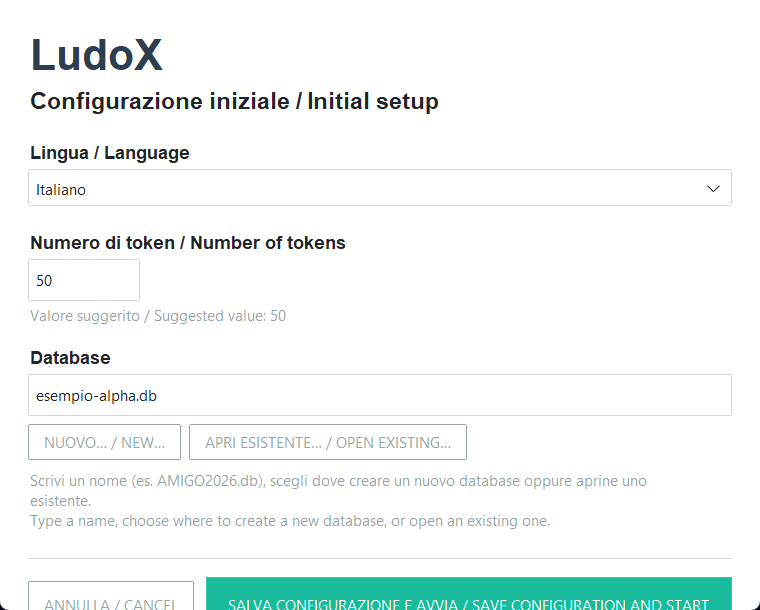
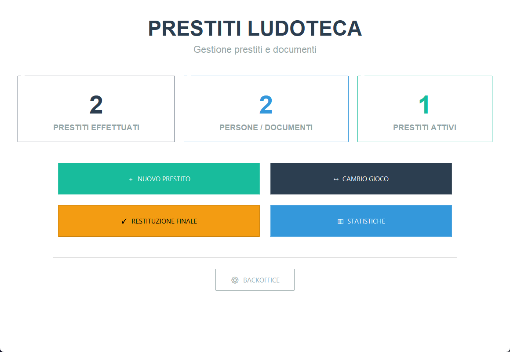
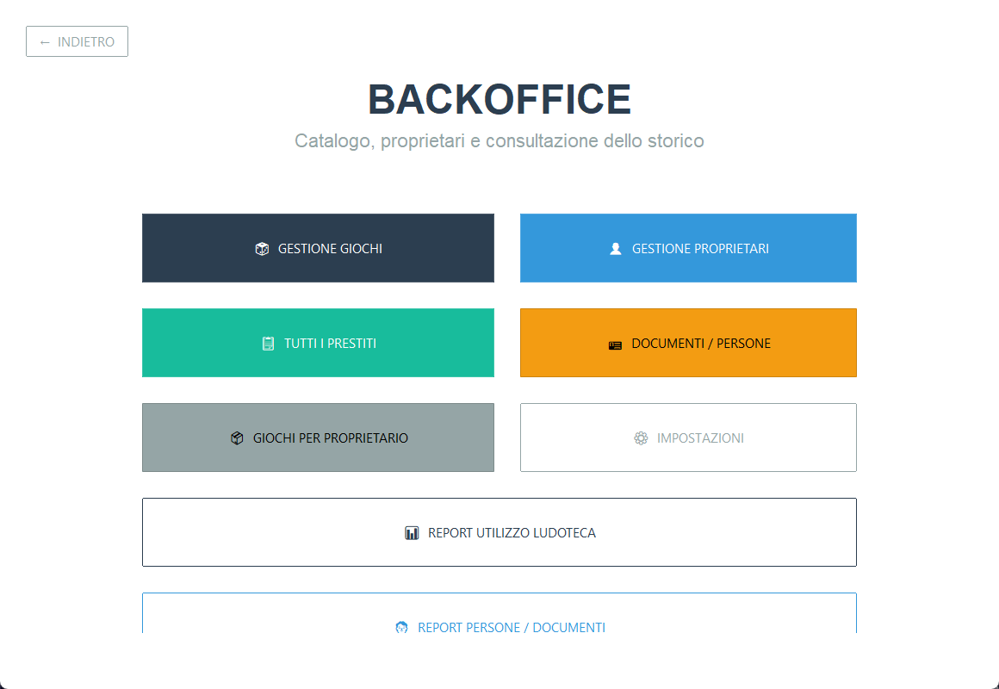
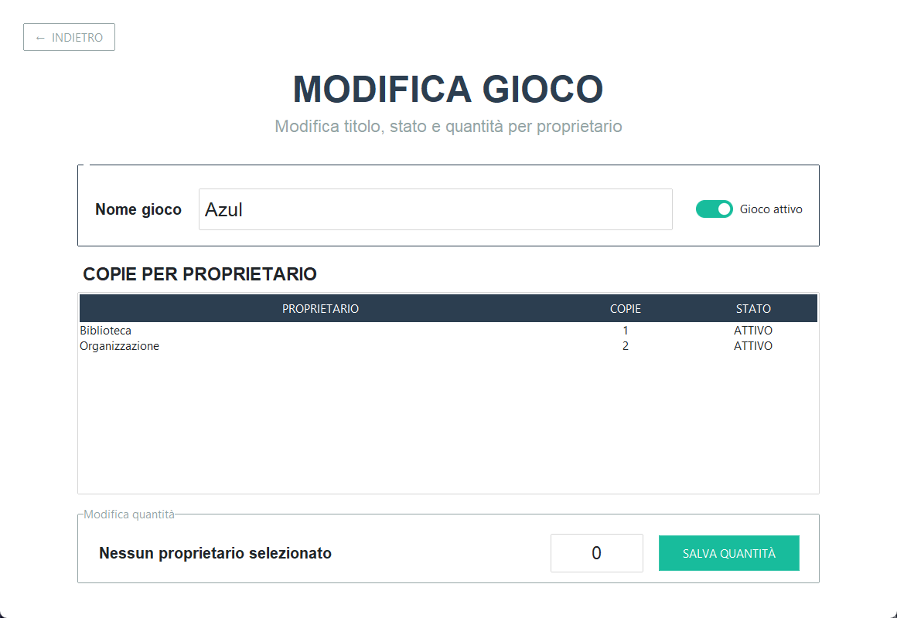
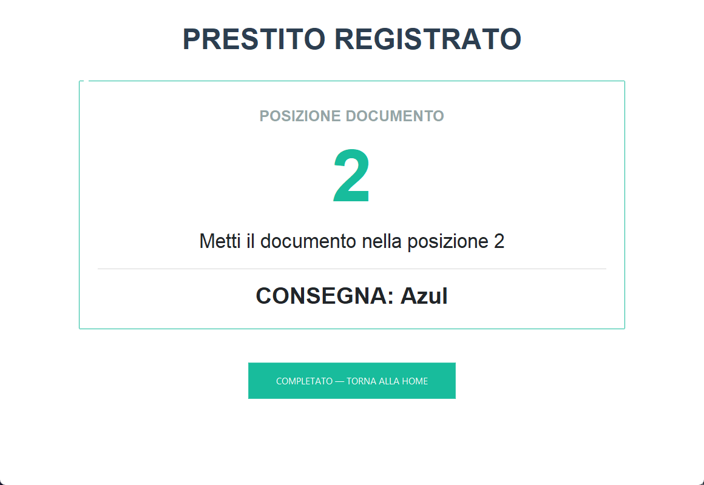
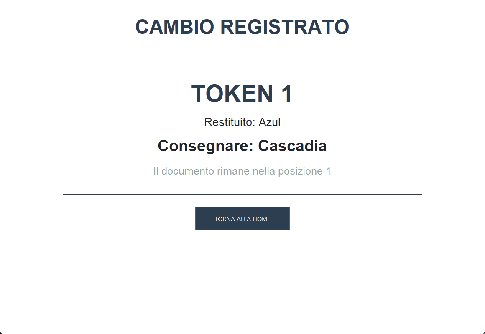
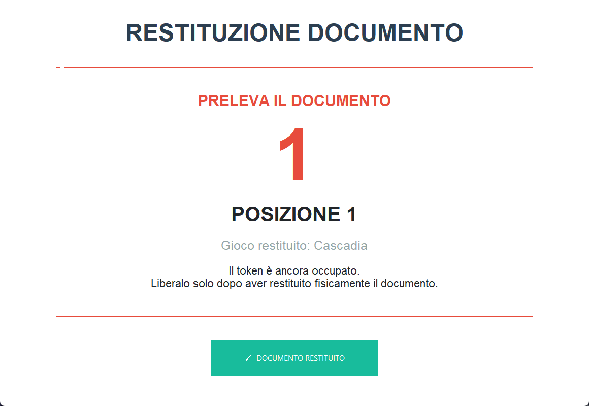
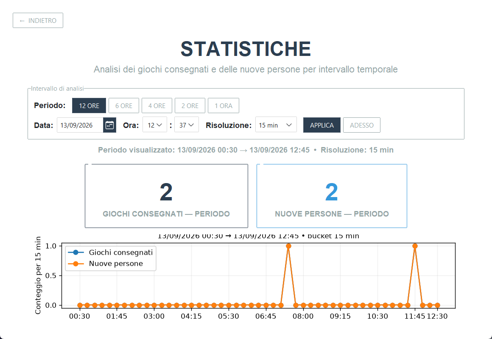
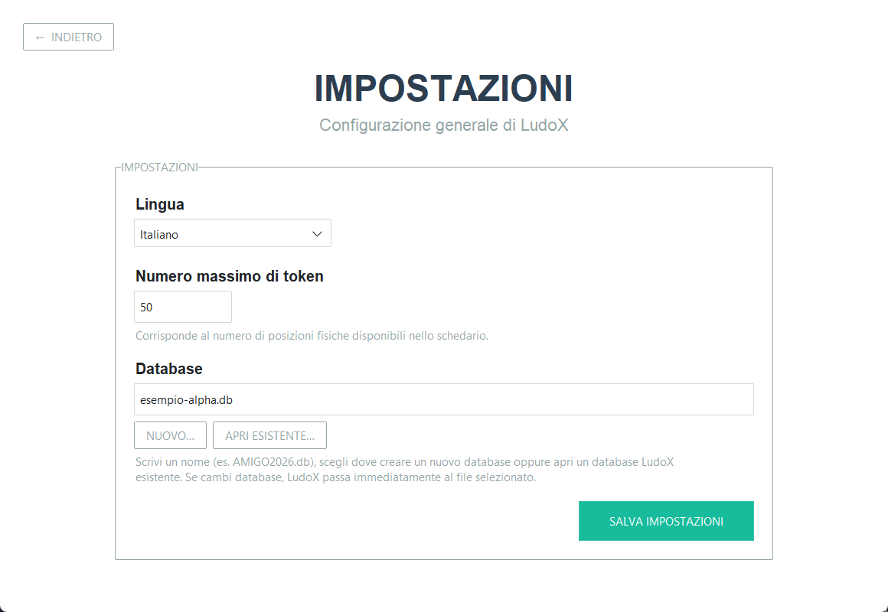

# LudoX — Guida rapida

**Versione 0.1.0-alpha**

LudoX è un'applicazione locale per gestire il prestito di giochi durante eventi, serate ludiche, biblioteche e ludoteche.

Questa guida descrive la versione **0.1.0-alpha** e il suo flusso principale: preparare la ludoteca, consegnare un gioco, gestire eventuali cambi e chiudere correttamente il prestito restituendo il documento.

> **Versione alpha**
>
> LudoX è ancora in sviluppo. Prima di utilizzarlo durante un evento reale è consigliato fare una prova completa della postazione, verificare i token fisici e controllare che il database selezionato sia quello corretto.

## 1. Come funziona LudoX

LudoX usa un sistema anonimo basato su **token numerati**.

Quando una persona prende un gioco:

1. consegna un documento alla postazione;
2. LudoX assegna automaticamente un token libero;
3. il documento viene custodito nella posizione fisica con lo stesso numero;
4. il token numerato viene consegnato alla persona;
5. LudoX registra il gioco in prestito.

Esempio:

```text
LudoX assegna TOKEN 27

Documento → posizione 27
Token 27  → persona
Gioco     → persona
```

LudoX **non registra nel database il nome della persona, il numero del documento o altri dati identificativi**.

Il numero del token serve soltanto a collegare temporaneamente il prestito alla posizione fisica in cui è custodito il documento.

### Materiale consigliato

Per utilizzare il sistema servono:

- un PC con LudoX;
- i giochi disponibili;
- token fisici numerati;
- uno schedario, portalistini o porta-carte con posizioni numerate;
- una postazione custodita e non liberamente accessibile al pubblico.

Il numero di token configurato in LudoX deve corrispondere alle posizioni fisiche realmente disponibili.

---

## 2. Avvio e configurazione iniziale

Al primo avvio LudoX mostra la schermata **Configurazione iniziale / Initial setup**.

Devi scegliere:

- **Lingua / Language**;
- **Numero di token / Number of tokens**;
- **Database**.

Il valore proposto per i token è **50**.

### Scelta del database

Il database contiene giochi, proprietari, prestiti e storico.

Puoi:

- scrivere direttamente un nome, per esempio `AMIGO2026.db`;
- premere **NUOVO… / NEW…** per scegliere dove creare un nuovo database;
- premere **APRI ESISTENTE… / OPEN EXISTING…** per utilizzare un database LudoX già esistente.

Se inserisci soltanto un nome, LudoX crea il database nella cartella dell'applicazione.

Quando hai terminato premi:

**SALVA CONFIGURAZIONE E AVVIA / SAVE CONFIGURATION AND START**



_Configurazione iniziale: lingua, numero di token e database._

> Conserva con attenzione il file del database. Contiene i dati operativi e lo storico della postazione.

---

## 3. La schermata principale

La Home mostra tre contatori:

- **PRESTITI EFFETTUATI** — numero complessivo dei prestiti registrati;
- **PERSONE / DOCUMENTI** — numero delle sessioni/documenti gestiti;
- **PRESTITI ATTIVI** — documenti attualmente depositati.

Le quattro azioni principali sono:

- **＋ NUOVO PRESTITO**
- **↔ CAMBIO GIOCO**
- **✓ RESTITUZIONE FINALE**
- **▥ STATISTICHE**

In fondo trovi:

- **⚙ BACKOFFICE**



_Home con contatori e operazioni principali._

---

# Preparazione della ludoteca

## 4. Entrare nel Backoffice

Dalla Home premi **⚙ BACKOFFICE**.

La password predefinita della versione alpha è:

```text
ludox
```

Premi **ACCEDI**.

La password serve a evitare accessi accidentali alla parte amministrativa, ma **non è una protezione di sicurezza forte**.

Nel Backoffice trovi:

- **GESTIONE GIOCHI**
- **GESTIONE PROPRIETARI**
- **TUTTI I PRESTITI**
- **DOCUMENTI / PERSONE**
- **GIOCHI PER PROPRIETARIO**
- **IMPOSTAZIONI**
- **REPORT UTILIZZO LUDOTECA**
- **REPORT PERSONE / DOCUMENTI**



_Backoffice con le funzioni di gestione, storico, report e impostazioni._

---

## 5. Gestire i proprietari

Un proprietario indica la persona o l'ente che mette a disposizione una o più copie di un gioco.

Un nuovo database contiene già un proprietario iniziale generico, normalmente **Organizzazione**.

Per aggiungerne altri:

1. apri **GESTIONE PROPRIETARI**;
2. premi **＋ AGGIUNGI PROPRIETARIO**;
3. inserisci il nome;
4. premi **SALVA PROPRIETARIO**.

Esempi:

```text
Organizzazione
Biblioteca
Mario
Associazione ABC
```

Dalla stessa schermata puoi selezionare un proprietario e premere **MODIFICA PROPRIETARIO SELEZIONATO**.

Un proprietario può essere disattivato. Se ha ancora copie associate, LudoX chiede una conferma.

---

## 6. Aggiungere i giochi

Prima di iniziare i prestiti devi inserire i giochi e indicare quante copie sono disponibili.

Apri:

**BACKOFFICE → GESTIONE GIOCHI**

Poi:

1. premi **＋ AGGIUNGI GIOCO**;
2. inserisci il nome del gioco;
3. premi **SALVA E ASSEGNA COPIE**.

LudoX apre la schermata **MODIFICA GIOCO**.

### Assegnare le copie

Nella sezione **COPIE PER PROPRIETARIO**:

1. seleziona il proprietario;
2. inserisci la quantità;
3. premi **SALVA QUANTITÀ**.

Puoi distribuire le copie dello stesso titolo tra più proprietari.

Esempio:

```text
Azul

Organizzazione → 2 copie
Biblioteca     → 1 copia

Totale         → 3 copie
```

Una quantità pari a `0` rimuove l'associazione tra quel proprietario e il gioco.

Premi **SALVA GIOCO** per salvare eventuali modifiche al nome o allo stato del titolo.

Un gioco disattivato non viene proposto nei nuovi prestiti. LudoX non permette di disattivarlo se ci sono ancora copie di quel titolo in prestito.



_Modifica del gioco e assegnazione delle copie ai proprietari._

---

# Durante l'evento

## 7. Nuovo prestito

Quando una persona vuole prendere un gioco:

1. ricevi fisicamente il documento;
2. dalla Home premi **＋ NUOVO PRESTITO**;
3. cerca il gioco digitando parte del titolo;
4. verifica la colonna **DISPONIBILITÀ**;
5. seleziona il gioco;
6. premi **CONFERMA** oppure fai doppio clic sul titolo.

LudoX assegna automaticamente il primo token libero.

La schermata **PRESTITO REGISTRATO** mostra in grande la **POSIZIONE DOCUMENTO**.

A questo punto:

1. prendi il token fisico con quel numero;
2. inserisci il documento nella posizione con lo stesso numero;
3. consegna il token alla persona;
4. consegna il gioco;
5. premi **COMPLETATO — TORNA ALLA HOME**.

Esempio:

```text
POSIZIONE DOCUMENTO: 27

Documento → posizione 27
Token 27  → persona
Gioco     → persona
```



_Prestito registrato con posizione del documento e gioco da consegnare._

### Se non ci sono token liberi

LudoX mostra **Token esauriti**.

Prima di fare nuovi prestiti devi completare una o più restituzioni finali oppure aumentare il numero dei token, se disponi fisicamente delle relative posizioni.

---

## 8. Cambio gioco

La persona può restituire il gioco e prenderne un altro mantenendo lo stesso token.

1. ricevi il gioco precedente;
2. dalla Home premi **↔ CAMBIO GIOCO**;
3. inserisci il numero del token;
4. premi **CONTINUA**;
5. controlla il **GIOCO ATTUALE** mostrato da LudoX;
6. cerca e seleziona il nuovo gioco;
7. premi **CONFERMA**.

LudoX chiude il prestito precedente e apre il nuovo prestito mantenendo lo stesso token.

La schermata **CAMBIO REGISTRATO** indica:

- il token;
- il gioco restituito;
- il nuovo gioco da consegnare.

### Importante

Durante il cambio gioco **non spostare il documento**.

```text
Prima:
Token 27
Documento → posizione 27
Gioco     → Azul

Dopo:
Token 27
Documento → posizione 27
Gioco     → Cascadia
```

Consegna nuovamente il token e il nuovo gioco alla persona.



_Cambio registrato mantenendo invariati token e posizione del documento._

---

## 9. Restituzione finale

Usa **RESTITUZIONE FINALE** quando la persona non vuole più prendere altri giochi e deve riavere il documento.

1. ricevi il gioco;
2. dalla Home premi **✓ RESTITUZIONE FINALE**;
3. inserisci il numero del token;
4. premi **CONTINUA**;
5. LudoX mostra il gioco associato;
6. conferma che il gioco è stato fisicamente restituito.

LudoX apre quindi la schermata **RESTITUZIONE DOCUMENTO** e mostra in grande la posizione del documento.

### Recupera prima il documento

1. vai alla posizione indicata;
2. recupera fisicamente il documento;
3. restituiscilo alla persona;
4. soltanto dopo premi **✓ DOCUMENTO RESTITUITO**;
5. conferma nuovamente la restituzione.

A questo punto LudoX chiude la sessione e il token torna disponibile.

```text
Gioco rientrato
      ↓
LudoX mostra POSIZIONE 27
      ↓
Recupera il documento
      ↓
Restituisci il documento
      ↓
DOCUMENTO RESTITUITO
      ↓
Token 27 libero
```

Questa doppia conferma evita di riassegnare un token mentre il documento precedente è ancora nello schedario.



_Posizione da cui recuperare il documento prima della conferma finale._

---

## 10. Se una persona perde il token

Il token non identifica personalmente la persona.

In caso di smarrimento **non restituire automaticamente un documento basandoti solo sulle indicazioni fornite dalla persona**.

Verifica la situazione secondo le procedure definite dalla tua organizzazione prima di consegnare qualsiasi documento.

---

# Controllo e statistiche

## 11. Statistiche

Dalla Home premi **▥ STATISTICHE**.

Puoi analizzare:

- giochi consegnati;
- nuove persone/documenti;
- andamento nel tempo.

Puoi scegliere rapidamente:

- **12 ORE**
- **6 ORE**
- **4 ORE**
- **2 ORE**
- **1 ORA**

Puoi inoltre impostare:

- data tramite calendario;
- ora;
- minuti;
- risoluzione del grafico.

Le risoluzioni disponibili sono comprese tra **5 e 30 minuti**.

Premi **APPLICA** per aggiornare la visualizzazione oppure **ADESSO** per riportare il riferimento al momento corrente.



_Statistiche con periodo, riferimento temporale, risoluzione e grafico._

---

## 12. Storico e report

Nel Backoffice sono disponibili diverse viste di controllo.

### TUTTI I PRESTITI

Mostra lo storico dei prestiti con:

- token;
- documento/sessione;
- gioco;
- inizio;
- rientro;
- stato.

### DOCUMENTI / PERSONE

Mostra il registro anonimo delle sessioni:

- token;
- deposito del documento;
- restituzione;
- numero di prestiti effettuati;
- stato.

Il software non contiene il nome della persona.

### GIOCHI PER PROPRIETARIO

Permette di scegliere un proprietario e vedere:

- titoli associati;
- copie del proprietario;
- copie totali;
- eventuali prestiti attivi del titolo.

### REPORT UTILIZZO LUDOTECA

Permette di analizzare l'utilizzo dei titoli in un intervallo di date, anche filtrando per proprietario.

Il report include indicatori come numero di prestiti, utilizzo dei titoli e durata dei prestiti conclusi.

Può essere esportato con **ESPORTA CSV**.

### REPORT PERSONE / DOCUMENTI

Analizza in forma anonima:

- numero di prestiti per sessione;
- tempo di permanenza del documento;
- durata media dei prestiti conclusi.

Anche questo report può essere esportato con **ESPORTA CSV**.

> L'esportazione CSV presente in questa versione riguarda i report. La versione 0.1.0-alpha non include un comando dedicato all'importazione/esportazione completa del catalogo dei giochi.

---

# Impostazioni

## 13. Modificare lingua, token e database

Apri:

**BACKOFFICE → IMPOSTAZIONI**

Puoi modificare:

- lingua;
- numero massimo di token;
- database utilizzato.



_Impostazioni della postazione: lingua, numero massimo di token e database._

### Numero massimo di token

Il numero deve corrispondere alle posizioni fisiche disponibili.

Esempio:

```text
Token configurati: 50
Token fisici:       1–50
Posizioni:          1–50
```

LudoX non permette di abbassare il limite sotto il numero di un token attualmente occupato.

### Cambiare database

Puoi:

- inserire un nome/percorso;
- creare un nuovo database;
- aprire un database esistente.

LudoX **non permette di cambiare database mentre ci sono documenti ancora depositati nel database corrente**.

Questa protezione evita di abbandonare una sessione aperta passando accidentalmente a un altro archivio.

> Prima di cambiare database verifica sempre quale archivio stai utilizzando e conserva una copia di sicurezza dei database importanti.

---

## 14. Chiusura di LudoX

Se provi a chiudere LudoX mentre risultano ancora documenti depositati, il programma mostra un avviso con:

- numero dei documenti ancora aperti;
- elenco dei token coinvolti.

Prima di chiudere la postazione verifica fisicamente che la situazione corrisponda a quanto mostrato.

A fine evento è consigliato arrivare a:

```text
PRESTITI ATTIVI = 0
```

e controllare che nello schedario non siano rimasti documenti.

---

# Problemi comuni

## Non vedo un gioco nell'elenco dei prestiti

Controlla in **BACKOFFICE → GESTIONE GIOCHI** che:

- il gioco sia attivo;
- abbia almeno una copia assegnata;
- ci siano copie disponibili.

---

## Il gioco risulta non disponibile

Tutte le copie configurate potrebbero essere già in prestito.

La schermata di selezione mostra:

```text
copie disponibili / copie totali
```

---

## Il token risulta libero durante un cambio o una restituzione

Verifica di aver inserito il numero corretto.

Un token può essere riutilizzato dopo la chiusura completa della sessione precedente.

---

## Non posso ridurre il numero dei token

Potrebbe esserci una sessione aperta con un numero di token superiore al nuovo limite richiesto.

Chiudi prima le sessioni interessate.

---

## Non posso cambiare database

LudoX blocca il cambio se nel database corrente risultano documenti ancora depositati.

Completa prima le restituzioni finali.

---

## Non posso disattivare un gioco

Un titolo con copie attualmente in prestito non può essere disattivato.

Completa prima i relativi prestiti.

---

## Ho chiuso LudoX con prestiti ancora aperti

I dati rimangono nel database.

Al riavvio, utilizzando lo stesso database, le sessioni risultano ancora aperte.

Verifica sempre anche la situazione fisica dei documenti e dei token.

---

# Buone pratiche per la postazione

- tieni i documenti fuori dalla vista del pubblico;
- rendi lo schedario accessibile solo alle persone incaricate;
- non scrivere nomi sui token;
- usa sempre la regola `token = posizione documento`;
- non spostare il documento durante un cambio gioco;
- conferma **DOCUMENTO RESTITUITO** solo dopo la consegna fisica;
- controlla periodicamente che token e posizioni siano completi;
- conserva copie di sicurezza del database;
- a fine evento verifica che non risultino prestiti attivi.

---

# Promemoria operativo

```text
NUOVO PRESTITO

ricevi documento
→ scegli gioco
→ LudoX assegna token N
→ documento in posizione N
→ token N alla persona
→ gioco alla persona
```

```text
CAMBIO GIOCO

ricevi gioco A
→ inserisci token N
→ scegli gioco B
→ documento resta in posizione N
→ token resta N
→ consegna gioco B
```

```text
RESTITUZIONE FINALE

ricevi gioco
→ inserisci token N
→ conferma rientro gioco
→ recupera documento da posizione N
→ restituisci documento
→ DOCUMENTO RESTITUITO
→ token N libero
```

---

# Segnalare un problema

LudoX è un progetto open source in fase alpha.

Per segnalare un bug o un comportamento inatteso utilizza il repository ufficiale:

**https://github.com/ludox-events/ludox**

Quando possibile indica:

- versione utilizzata: `0.1.0-alpha`;
- sistema operativo;
- cosa stavi facendo;
- cosa ti aspettavi;
- cosa è successo.

Non allegare database reali contenenti informazioni che non vuoi condividere.
